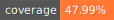
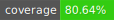
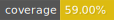
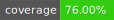

# CityMall Services Code Coverage

#### <a href="https://github.com/city-mall/central-code-coverage">go-coverage</a> 

#### <a href="https://github.com/sushant8421/central-code-coverage">node-coverage</a> 

package wise coverage

<ul>
<li><strong>api-server</strong> </li>
<li><strong>commons</strong> </li>
<li><strong>worker</strong> </li>
</ul>

#### <a href="https://github.com/sushant8421/central-code-coverage">python-coverage</a> 

package wise coverage

<ul>
<li><strong>producer</strong> </li>
<li><strong>reader</strong> </li>
<li><strong>worker</strong> </li>
</ul>

